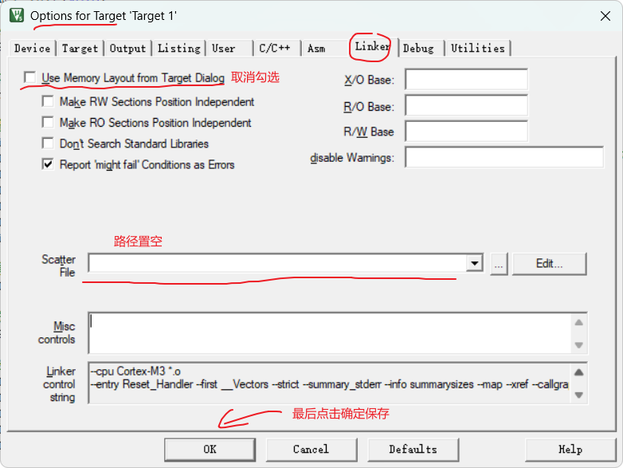

### 问题描述：

​	使用Keil编译工程时，编译无法成功，且出现如下调试信息：

```
linking...
.\Project1.axf: error: L6031U: Could not open scatter description file Project1.sct: No such file or directory
Not enough information to list image symbols.
Not enough information to list load addresses in the image map.
Finished: 2 information, 0 warning, 0 error and 1 fatal error messages.
".\Project1.axf" - 1 Error(s), 0 Warning(s).
Target not created.
```

### 分析：

​	项目目录中缺少分散加载描述文件 `Project1.sct`  或是 `.sct`文件的路径不正确。

### 解决方法：

​	目前来看，其中一个解决办法是：

​	进入`Option for Target`菜单卡 -> `Linker` -> 取消勾选 `Use Memory Layout from Target Dialog.`-> 并且将下方的`Scatter file`路径置空 -> 确定保存，重新编译即可。如下图所示：


