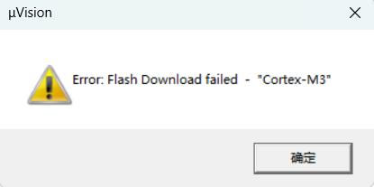

### 问题描述：

​	Keil烧录失败，出现如下调试信息：

```
No Algorithm found for: 00008000H - 00008D8BH
Programming skipped!
Error: Flash Download failed  -  "Cortex-M3"
```



###  分析：

​	~~1.出错地址范围可能超出了`Flash`的容量。本例中所用的芯片型号为 `STM32F103C8T6`.且换用另一工程时正常烧录，两工程Flash配置完全一致，故此处排除该可能。~~

​	~~2.芯片型号与算法配置问题。此处使用的芯片包为`Keil::STM32F1xx_DFP@1.0.4`，所选芯片(Device)为`STM32F103C`。 之前使用的是2.4新版本，出现问题后换用老版本芯片包，仍未解决问题。且相同配置工程可以正常烧录，故排除此可能。~~

​	~~3.可能跟芯片保护问题有关。keil中将芯片整体`Erase`掉，但是完全擦除扇区成功后，仍无法将该工程程序烧录进去。况且相同配置工程能够成功烧录，故排除此可能。~~

​	~~4.软件与驱动问题。我所用烧录工具为 ST-LINK V2，烧录前已经在Keil中将框架升级到最新版本，相同芯片其余工程能够烧录成功，故排除此可能。~~

​	5.工程配置问题。其余工程能够烧录成功，而该工程无法烧录，这么一比较工程配置有问题的可能性是最大的。但是仔细核对过两工程之间的配置，是完全一致的。

​	问题待解决......