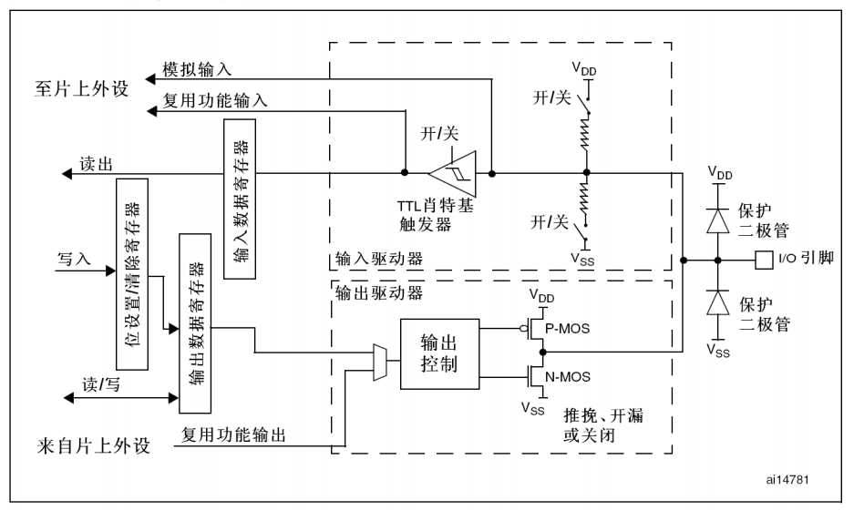
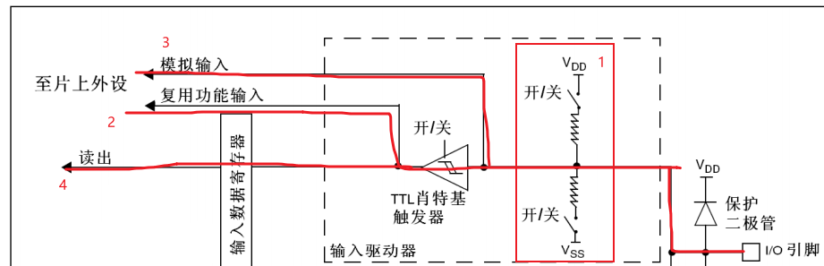
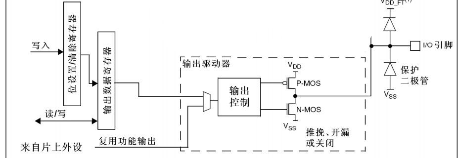
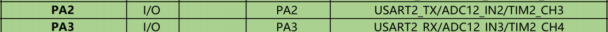
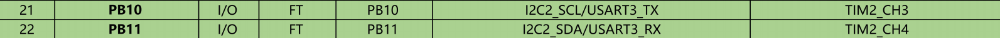

# GPIO

​	通用输入输出接口，用于与外部设备通信或控制。 

## GPIO 相关寄存器

​	STM32中（此处以`STM32F103C8T6`为例），与每个`GPIO`端口控制及配置相关的32位寄存器主要有7个：

### CRH & CRL（端口配置高位 & 低位寄存器）


​	如上图所示，为`CRH`端口配置示意图。 

- 其中，`CNFx`为该端口的对应引脚的配置位域（例如`CNF11`则为对应端口的11号引脚）。由于该寄存器配置的是高位引脚，因此从8号引脚开始至15号引脚结束。**`CNF`决定了引脚的功能模式**。 
- **`MODEx`配置了引脚的输入或输出模式，以及输出的速度。** [00] 输入模式 ； [01] 输出模式（10Mhz）；[10] 输出模式（2Mhz）；[11] 输出模式（50Mhz）。

当`MODE`配置到输入模式时（[00]）:

​	`CNF`：[00] 模拟量输入 ； [01] 浮空输入 ； [10] 上拉/下拉输入 ； [11] 保留位。

当`MODE`配置到输出模式时（[01] / [10] / [11]）：

​	`CNF`：[00] 推挽 ； [01] 开漏  ；[10] 复用推挽  ；[11] 复用开漏

**每一个引脚的`CNF`与`MODE`是成对匹配的（也就是每个引脚有4个配置位，两位MODE两位CNF）。`CRL`是设置低8位的引脚（0~7），原理与`CRH`一致**。

### IDR（端口输入数据寄存器）

​	`IDR` 寄存器 **用于读取端口每个引脚的电平，0为低电平 ， 1为高电平** 。只读，不可写。 该寄存器配置如下图：


可见，`IDR`高16位保留，低16位每一位对应着每个引脚的电平状态。

### ODR（端口输出数据寄存器）

​	`ODR`寄存器 **用于设置端口每个引脚的电平输出状态，0为低电平，1为高电平**。与`IDR`同理，高16位保留，低16位每位对应唯一的引脚，`ODR`可读可写，向其中写入0或1来设置当前端口对应引脚的电平状态。


### BSRR（端口位设置/位清除寄存器）

​	BSRR顾名思义， **用于设置与清除引脚的输出状态**。复位值为0x0000 0000。高16位用于清除对应引脚的输出状态，向高16位写1将会清除对应引脚的电平状态；低16位用于设置对应引脚的输出状态，向低16位写1会使对应引脚输出高电平。


​	只可写入。值得注意的是：**`BSRR`寄存器只能整体进行操作**。这里“整体进行操作”的意思是，需要明确指定所有32位中哪些位需要置位（低16位）、哪些位需要清除（高16位），并一次性写入，而不可以单独操作某一位而其他位保持不变。例如下例

```c
//将PA0和PA3置为高电平。
//将PA5清除。
GPIOA->BSRR = 0x00200009; // 直接向其写入32位数据
```

### BRR（端口位清除寄存器）

​	`BRR`与`BSRR`类似， **用于将端口对应的引脚的输出状态清除。高16位保留，低16位每个位对应一个引脚，向其中写入1来清除对应引脚电平**。只可写，且同样只能整体进行写入操作。


### LCKR（端口配置锁定寄存器）

​	`LCKR` **用于锁定`GPIO`的某些配置寄存器，防止误操作导致`GPIO`的配置被不经意间修改**。一但某个端口的某些引脚被锁定，则无法通过正常的写操作来进行修改，除非将其解锁。


​	`LCKR`低16位用于设置端口对应的引脚的锁定配置，为0则不锁定该引脚，为1则锁定该引脚的配置。第17位`LCKK`为锁键，用于确认锁定或解锁操作是否有效。


## GPIO端口位结构硬件电路图



​	上图为GPIO端口内，每一个引脚的内部结构电路图。每一个引脚都可以配置成相对应的输入/输出模式。从中间一分为二，上半部分为输入电路，下半部分为输出电路。

​	

​	先来看输入电路。

​	1部分为电路的**输入模式上下拉电路部分**。上拉电阻（连接至VDD）与下拉电阻（连接至VSS）可通过软件进行配置（向`CRH & CRL`寄存器中写入配置）。当连接至VDD的开关闭合，连接至VSS的开关断开时，该引脚则被配置为**上拉输入模式**。**当输入信号为确定电平时（低/高电平），信号不受影响（因为外部驱动信号足够强，能够克服上拉电阻的影响。）；当输入没有明确的电平信号时（浮空），则由于上拉电阻的影响，默认被拉到高电平，读取电平逻辑值 为 1**。

​	当VSS开关闭合，VDD开关断开时，该引脚被配置为**下拉输入模式**。同上拉输入，**对于明确的高低电平信号输入，下拉电阻并不会影响信号；当输入没有明确电平信号（输入浮空）时，则由于下拉电阻的影响，默认被拉到低电平， 读取电平逻辑值为0**。

​	当**两开关均闭合时，则输入为浮空输入模式**。此时如果引脚浮空，则电平状态是不确定的，且`GPIO`引脚状态易受外部信号扰动干扰，进而可能导致误触发等问题。

​	3部分电路为引脚的**模拟量输入模式，此时`GPIO`近似可以看作是无效的，对信号没有修饰，原模拟信号直接进入片上`ADC`外设**。ps：当使用模拟量输入时，会关闭数字信号输入的线路。

​	2部分为引脚的复用功能通路。

​	4部分电路则为**引脚的状态读取电路，`GPIO`当前的电平信号将经过TTL肖特基触发器后存入到输入数据寄存器（`IDR`）中，而后从`IDR`中读出当前引脚的电平状态**。

​	2，4部分均经过了**TTL肖特基触发器**，该元件的作用是对输入的信号进行整形的：当输入电压大于某一阈值时，瞬间将其拉为高电平，小于这一阈值时，则拉为低电平。目的是消除输入信号中的噪声或毛刺，让信号更干净。而模拟输入由于需要高保真信号，因此不经过此元件。



​	说完了输入，现在看引脚的输出电路部分。输出有三条路径：

- 向`BSSR`中整体写入引脚输出信号，同时将改变后的`GPIO`引脚输出状态写入`ODR`，从`ODR`中读取信号经过输出驱动器修饰进而输出到引脚。
- 直接向`ODR`中写入引脚的输出状态，而后从中读取进入输出驱动器修饰后输出到引脚。
- 或是来自片上的其他外设（例如定时器将PWM信号通过指定的`GPIO`口进行输出）。

​	输出控制部分接入了两个`MOS`管，**当`P-MOS`与`N-Mos`均有效时**，输出为**推挽输出**，可输出高电平VDD，低电平VSS；**当仅有`N-MOS`管有效时，则为开漏输出**。开漏输出低电平为VSS，高电平呈现高阻态，若想输出高电平可以外接上拉电阻。

​	**值得注意的是，输出模式的配置是不影响输入模式的，输入模式依然可用**。

## GPIO复用

### 	复用功能

​	什么叫复用？复用广义上指的是除了自身的功能外，还可以用作其他用途。**对于`GPIO`复用，则指同一个`GPIO`引脚可以被配置为多种不同的功能。**

​	关于GPIO，共有两种功能：

- **通用功能模式：**在这种模式下`GPIO`引脚用作常规的输入输出，由输入数据寄存器和输出数据寄存器进行管控，可由用户程序进行操纵。
- **复用功能模式：**当`GPIO`被配置为复用功能时，则该引脚不再由用户的程序直接控制，而是交由stm32内部的模块（例如`ADC`，定时器`TIM`等）控制。

​	**每个`GPIO`口都有对应的默认复用功能**，有的可被复用为定时器的其中一路通道，有的可作为串口数据发送/接收引脚，亦或有的默认复用功能就直接是作为通用`GPIO`输入输出口，具体可以参考芯片的引脚定义图。例如下图，给出了`STM32F103C8T6`最小系统板的引脚定义图的部分：



​	从上图可以看到，`PA2`与`PA3`引脚除了作为通用的`GPIO`输入输出口，同时也被复用为了串口2的数据发送/接收口，`ADC1`与`ADC2`的信号输入通道2/3，通用定时器`TIM2`的通道3与通道4。

​	对于复用输出功能，其模式必须配置为**复用推挽输出** / **复用开漏输出**，**同时复用输入功能也是开放的**，**输入通道被自动配置为浮空输入模式**。**若将一个引脚配置成为复用输出模式，则该引脚将会与输出数据寄存器断开，转而交由片上外设控制输出。倘若外设没有激活，则输出是不确定的**。

### 	重映射功能

​	尽管有了复用功能，但有时这可能并不能满足我们的使用需求。例如当某个引脚不可用，而我们刚好需要通过该引脚与其上对应的复用外设进行通信时，这该怎么办呢？这就要提到`GPIO`复用中的另一大功能：引脚的重映射功能。

​	重映射，顾名思义：**其允许将⽚上外设的复⽤功能从其默认的 `GPIO` 引脚移⾄其他引脚**。  一个引脚除了对应的默认复用功能以外，可能还有别的外设重映射到该引脚上。例如：



`PB10`与`PB11`引脚除了自身的通用输入输出功能以及默认复用的`I2C`的时钟信号，数据信号，与USART的TX，RX。同时也被映射为了通用定时器`TIM2`的通道3与通道4.

从上面可以看到`PA2`与`PA3`的默认复用功能有`TIM2`的通道3/4。当`PA2`与`PA3`不可用时，便可通过配置`PB10`与`PB11`，进而使用`TIM2`的通道3与通道4.重映射对于解决 PCB 设计中的物理布局问题或避开已损坏/占⽤的 `GPIO` 引脚⾮常有⽤ 。

### AFIO相关寄存器

​	

​	


​	


​	


​	

