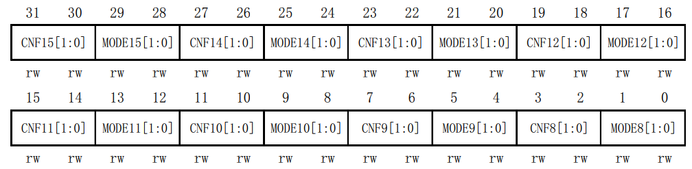
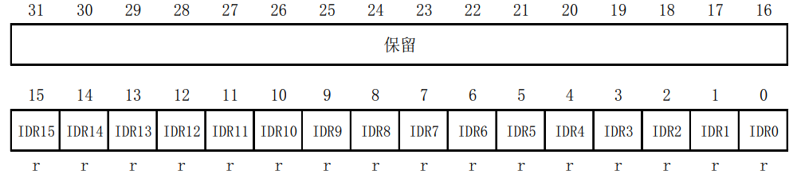
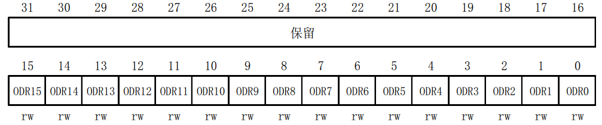
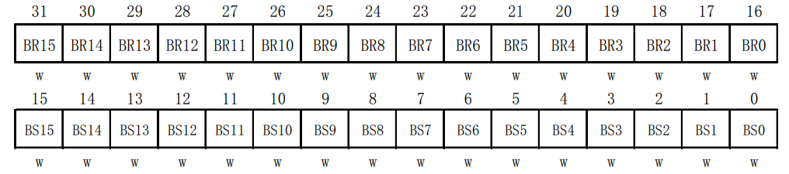
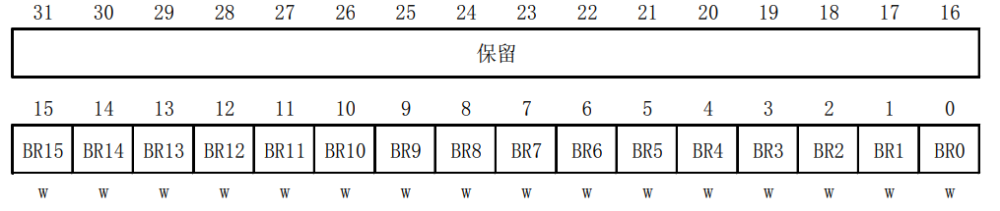
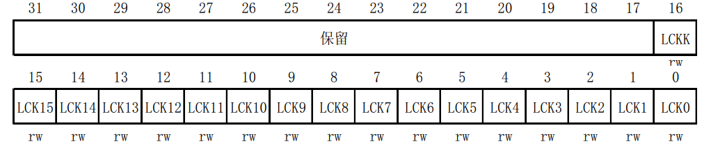

# GPIO

​	通用输入输出接口，用于与外部设备通信或控制。 

## GPIO 相关寄存器

​	STM32中（此处以`STM32F103C8T6`为例），与每个`GPIO`端口控制及配置相关的32位寄存器主要有7个：

### CRH & CRL（端口配置高位 & 低位寄存器）



​	如上图所示，为`CRH`端口配置示意图。 

- 其中，`CNFx`为该端口的对应引脚的配置位域（例如`CNF11`则为对应端口的11号引脚）。由于该寄存器配置的是高位引脚，因此从8号引脚开始至15号引脚结束。**`CNF`决定了引脚的功能模式**。 
- **`MODEx`配置了引脚的输入或输出模式，以及输出的速度。** [00] 输入模式 ； [01] 输出模式（10Mhz）；[10] 输出模式（2Mhz）；[11] 输出模式（50Mhz）。

当`MODE`配置到输入模式时（[00]）:

​	`CNF`：[00] 模拟量输入 ； [01] 浮空输入 ； [10] 上拉/下拉输入 ； [11] 保留位。

当`MODE`配置到输出模式时（[01] / [10] / [11]）：

​	`CNF`：[00] 推挽 ； [01] 开漏  ；[10] 复用推挽  ；[11] 复用开漏

**每一个引脚的`CNF`与`MODE`是成对匹配的（也就是每个引脚有4个配置位，两位MODE两位CNF）。`CRL`是设置低8位的引脚（0~7），原理与`CRH`一致。**

### IDR（端口输入数据寄存器）

​	`IDR` 寄存器**用于读取端口每个引脚的电平，0为低电平 ， 1为高电平。** 只读，不可写。 该寄存器配置如下图：



可见，`IDR`高16位保留，低16位每一位对应着每个引脚的电平状态。

### ODR（端口输出数据寄存器）

​	`ODR`寄存器**用于设置端口每个引脚的电平输出状态，0为低电平，1为高电平。**与`IDR`同理，高16位保留，低16位每位对应唯一的引脚，`ODR`可读可写，向其中写入0或1来设置当前端口对应引脚的电平状态。



### BSRR（端口位设置/位清除寄存器）

​	BSRR顾名思义，**用于设置与清除引脚的输出状态。**复位值为0x0000 0000。高16位用于清除对应引脚的输出状态，向高16位写1将会清除对应引脚的电平状态；低16位用于设置对应引脚的输出状态，向低16位写1会使对应引脚输出高电平。



只可写入。以下示例为直接操纵寄存器，向`GPIOA`的8号引脚（即`PA8`）写入高电平，并且将12号引脚（即`PA12`）输出状态清除。

```c
GPIOA -> BSRR = 1 << 8;
GPIOA -> BSRR = 1 << 24;
```


### BRR（端口位清除寄存器）

​	`BRR`与`BSRR`类似，**用于将端口对应的引脚的输出状态清除。高16位保留，低16位每个位对应一个引脚，向其中写入1来清除对应引脚电平。**只可写。



### LCKR（端口配置锁定寄存器）

​	`LCKR`**用于锁定`GPIO`的某些配置寄存器，防止误操作导致`GPIO`的配置被不经意间修改。**一但某个端口的某些引脚被锁定，则无法通过正常的写操作来进行修改，除非将其解锁。



​	`LCKR`低16位用于设置端口对应的引脚的锁定配置，为0则不锁定该引脚，为1则锁定该引脚的配置。第17位`LCKK`为锁键，用于确认锁定或解锁操作是否有效。


​	


​	

