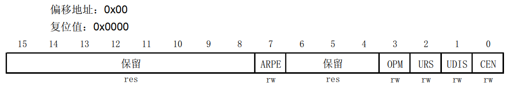
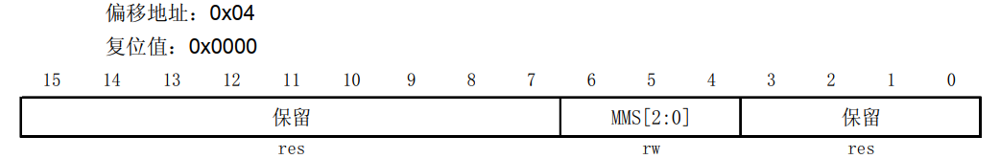
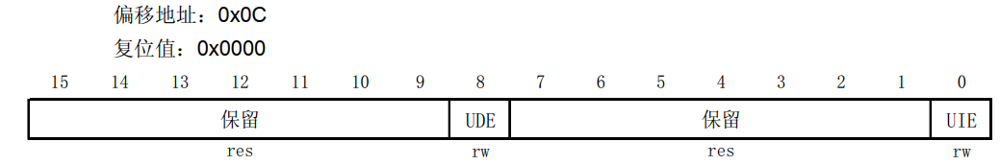
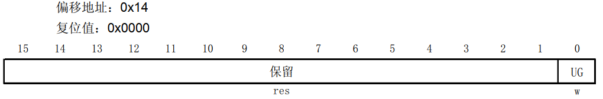
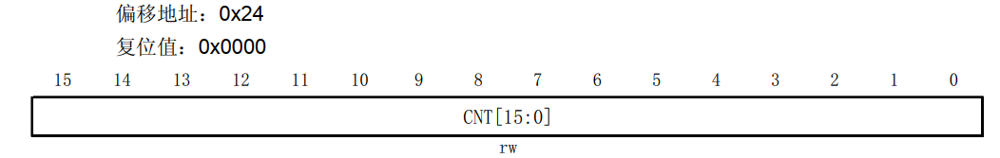
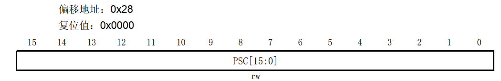
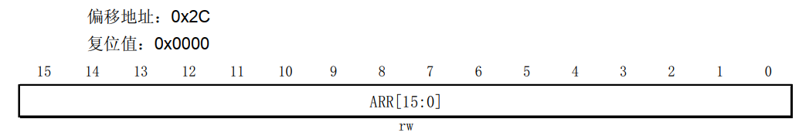

## STM32 基本定时器

​	`STM32`内部集成了多个不同种类的定时器，其中分别为：**基本定时器** ， **通用定时器** ， **高级定时器**。

- **基本定时器**：顾名思义，结构最简单，多用作定时通断，主模式触发`DAC`等。**只能选择内部时钟进行驱动**。
- **通用定时器**：在完全拥有基本定时器的基础上，还拥有多路独立通道，并且具有**内外时钟源的选择**功能，具有**输入捕获**，**输出比较**功能，**编码器接口**，**主从触发模式**等功能。
- **高级定时器**：在拥有通用定时器的基础之上，额外具备了**死区生成**，**重复计数**，**互补输出**，**刹车输入**等功能。

除此之外，还有一些特殊的专用定时器，例如独立看门狗，实时时钟等等。

​	以下是基本定时器的结构图：

​	可以看到，基本定时器**仅能由内部时钟信号驱动**（通常来源于`APB1`的预分频输出），可通过`TRGO`引脚输出一个触发信号，或是时钟信号分频后作为计数频率来产生定时中断。

​	**自动重装定时器**（ARR）是一个提前就设定好值的，用于存储定时目标值的寄存器。对于`STM32F103C8T6`而言，其是大小为16位的寄存器，可计次65536次。当`CNT`计数器的值达到该目标值时，会产生一个更新事件，在中断通道正确使能的情况下，会立马产生一个更新中断，同时将`CNT`计数器的值置0，重新开始计数。

​	**为了增大计时的范围，在`CNT`计数器之前增加了一个预分频器，可将由内部时钟过来的时钟源进一步分频**。该预分频器依然是16位的，因此分频系数最多可进行65536分频。由 **f = 72*10^6 / 65536 , 65536 / f = T**,计算可得，最大计时范围`Tmax`在59秒左右。

​	注意：

​	对于预分频器，**分频系数 = 写入值 + 1**. 例如写1的话，则1+1=2 ， 为2分频。72/2 = 36mhz。

​	计数器是从0开始计数的，若要记数N个脉冲，则`ARR`应设置为`M - 1`！这样计数器`CNT`从0计数到`M - 1`，刚好N个数，触发更新事件 / 中断。

### 定时周期的计算

​	定时周期是由 `PSC`（预分频系数） ， `ARR`（自动重装寄存器值）一起共同决定的。其计算公式如下：
$$
T_{定时} = \frac{(PSC + 1) \times (ARR + 1)}{f_{时钟}}
$$
​	本质上，该公式其实就是 **时钟的输入源频率`f`先经过预分频器，经历了`PSC + 1`个分频。而后以分频后的频率驱动计`ARR + 1`个数，其所花的时间便是定时周期**。

​	例如：要在时钟源频率为72Mhz的条件下计时一秒。便可将`ARR`设置为9999 ， `PSC`设置为7199（或是`PSC`为9999 ， `ARR`为7199）代入上式便可计算得到计时1秒的结果。

### 影子寄存器

​	**预分频器** 与 **ARR自动重装定时器**在运行过程中是可以进行更改的，但是向其中**写入数据时，并不是立刻生效，而是得等到当次计时完毕，计数器重新清0时才会生效**。其原因是**预分频器与ARR内部都有一个影子寄存器**（如下图）

**只有当当前计时周期结束，才会把新的预分频值 / 重装载值写入影子寄存器中并开始运用。**

**影子寄存器**：

​	通常是主寄存器的一个副本，能够在特定条件下保存或恢复主寄存器的状态。在嵌入式系统或微控制器中，影子寄存器可以用来临时存储配置数据，避免在中断处理或其他关键操作期间对主寄存器的直接访问，从而减少冲突、提高效率或增强系统的容错能力。

​	下图为将预分频系数由1置为2的计数器时序图

​	可以看到，时钟源频率为`CK_PSC`，**在给出一个使能信号`CNT_EN`一个周期后**，定时器时钟`CK_CNT`开始运行，并且开始驱动计数器寄存器开始计数。过程中，向预分频器写入新的数值，可以看到并**没有立即生效，一直到本轮计数周期结束，`CNT`计数器归0时才进写入的数值装填并进行运用，`CK_CNT`才真正被2分频**。

### 	基本定时器的寄存器

#### **控制寄存器**(`TIMx_CR1` & `TIMx_CR2`)

`TIMx_CR1`

​	

​	如上图为基本定时器的控制寄存器1号。对于基本定时器而言，仅有7，0~3位有效，其余全部保留。其中：

- **[7]  ARPE(自动重装预载使能)**：该位用于控制自动重载寄存器（`TIMx_ARR`）是否具有缓冲功能。上面我们提到ARR是拥有影子寄存器的，该位就用于配置影子寄存器是否生效。**当该位写0时，影子寄存器被屏蔽，在这种情况下，如果修改了 `TIMx_ARR` 的值，新值会立即生效，可能导致定时器的行为不连续或不稳定**。**当该位写1时，修改 `TIMx_ARR` 的值不会立即生效，而是会在下一次更新时应用到影子寄存器**。
- **[3] OPM(单脉冲模式)**：顾名思义，**当该位写0时则表示不启用单脉冲模式，在发生更新时计数器的运行不会受影响**。**当该位写1时，表示启用单脉冲，当发生一次更新时将定时器的使能位置0，使定时器停止运行**。如果需要再次启动定时器（即使 `OPM` = 1），都必须手动重新设置计数器的使能位。
- **[2] URS(更新请求源配置位)**：该位**用于控制更新事件，也就是哪些事件能够引起更新中断或向`DMA`发送请求**。当该位**写0时，允许所有可能的更新事件源触发中断或发起 `DMA` 请求**。例如：**定时器计数溢出**（完成一次计数），**手动控制事件相关的寄存器发起中断事件**（软件触发）， 以及**从模式引起的中断**等等。种种这些事件均可被响应。**当该位写1时，仅响应定时器计数溢出所产生的中断事件或`DMA`请求，其余情况虽然会触发更新事件，但是不予响应**。
- **[1] UDIS(禁止更新)**：该位用于**控制更新事件的通断**。与上面的`URS`进行比较：**`URS`是能够产生更新事件，但是选择性进行响应**，而**`UDIS`是直接禁止产生更新事件**。该位**写0允许更新事件的生成，写1禁止更新事件的生成，即使触发条件满足也不会产生更新事件**。
- **[0] CEN(计数器使能位)**：写0关闭计数器，写1使能计数器。

注：预分频器`PSC`与自动重装寄存器`ARR`虽然都有影子寄存器，但是二者是有区别的！ARR的影子寄存器可由`CR1`寄存器上的`ARPE`位进行控制，但是**`PSC`的影子寄存器是由硬件固有机制控制的，而不是由某个特定的配置位来决定**。

`TIMx_CR2`

#### DMA 中断使能寄存器(`TIMx_DIER`)

`TIMx_DIER`:

- **[8] UDE(更新`DMA`请求使能)**：写0禁止更新`DMA`请求，写1允许更新`DMA`请求**。也就是说，是否在定时器产生一个更新事件的同时，发出一个`DMA`请求**。
- **[0] UIE(更新中断使能)**：同上，写0禁止更新中断，写1允许更新中断。**也就是定时器在产生一次更新事件的同时，会不会触发一个更新中断**。

#### 状态寄存器(`TIMx_SR`)

`TIMx_SR`:

- **[0] UIF(更新中断标志)**：**当该位为0时，表示没有产生更新；当该位为1时，表示产生了更新中断**。该位比较特殊，常常是由硬件置1，例如计数器溢出产生一个更新中断时，该位就被硬件置1。当然清除需要软件方式来清除，因此在中断处理函数中往往最后一步是将该位软件重置。

#### 事件产生寄存器(`TIMx_EGR`)

`TIMx_EGR`:

- **[0] UG(产生更新事件)**：该位**用于手动触发更新事件**，其由软件设置，由硬件自动清除，默认复位值为0。当向该位写1时，定时器会重新初始化计数器（`CNT`寄存器清0），同时产生一个更新事件。当相关后继操作完毕后`UG`位又被硬件自动置0，自动复位。

#### 计数器(`TIMx_CNT`)

`TIMx_CNT`：

​	该寄存器的值就是定时器的计数值。有16位，总共可计数65536个数（0~65535）。

#### 预分频器(`TIMx_PSC`)

`TIMx_PSC`：

​	该寄存器用于设置预分频器的数值，**时钟源频率**经过预分频器后得到**计数器时钟频率**。该寄存器也是16位的，所以同理，最高可进行65536个分频。**在每一次更新事件时， `PSC`的数值被传送到实际的预分频寄存器中**。

#### 自动重装寄存器(`TIMx_ARR`)

`TIMx_ARR`：

​	该寄存器用于设置重装载的值，其为16位，最大可设置成65535。当计数器的数值与该寄存器相等时，将溢出并产生一次更新中断。如果自动重装载数值为0，则计数器停止。注意：`ARR`寄存器存在影子寄存器，具体作用详见上面关于`ARPE`位的解释。

