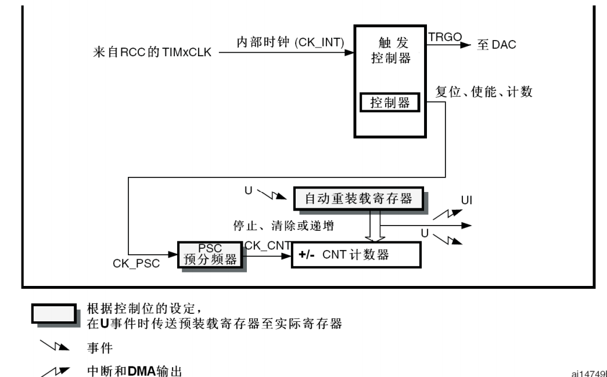
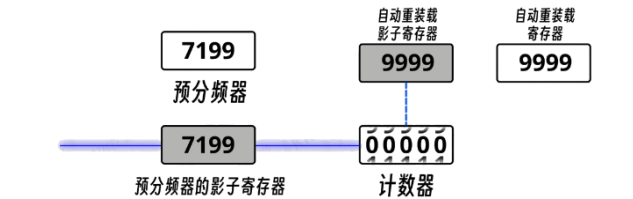
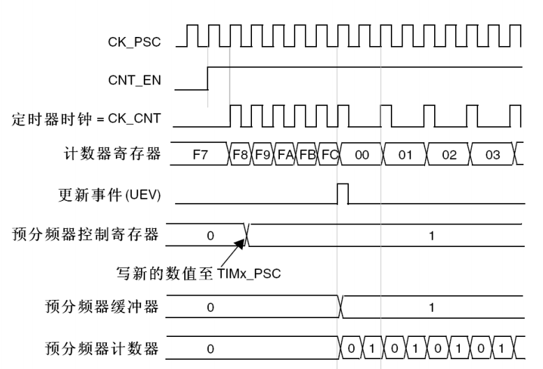

## STM32 基本定时器

​	`STM32`内部集成了多个不同种类的定时器，其中分别为：**基本定时器** ， **通用定时器** ， **高级定时器**。

- **基本定时器**：顾名思义，结构最简单，多用作定时通断，主模式触发`DAC`等。**只能选择内部时钟进行驱动**。
- **通用定时器**：在完全拥有基本定时器的基础上，还拥有多路独立通道，并且具有**内外时钟源的选择**功能，具有**输入捕获**，**输出比较**功能，**编码器接口**，**主从触发模式**等功能。
- **高级定时器**：在拥有通用定时器的基础之上，额外具备了**死区生成**，**重复计数**，**互补输出**，**刹车输入**等功能。

除此之外，还有一些特殊的专用定时器，例如独立看门狗，实时时钟等等。

​	以下是基本定时器的结构图：

​	可以看到，基本定时器仅能由内部时钟信号驱动（通常来源于`APB1`的预分频输出），可通过`TRGO`引脚输出一个触发信号，或是时钟信号分频后作为计数频率来产生定时中断。

​	**自动重装定时器**（ARR）是一个提前就设定好值的，用于存储定时目标值的寄存器。对于`STM32F103C8T6`而言，其是大小为16位的寄存器，可计次65536次。当`CNT`计数器的值达到该目标值时，会产生一个更新事件，在中断通道正确使能的情况下，会立马产生一个更新中断，同时将`CNT`计数器的值置0，重新开始计数。

​	**为了增大计时的范围，在`CNT`计数器之前增加了一个预分频器，可将由内部时钟过来的时钟源进一步分频**。该预分频器依然是16位的，因此分频系数最多可进行65536分频。由 **f = 72*10^6 / 65536 , 65536 / f = T**,计算可得，最大计时范围`Tmax`在59秒左右。

​	注意：

​	对于预分频器，**分频系数 = 写入值 + 1**. 例如写1的话，则1+1=2 ， 为2分频。72/2 = 36mhz。

​	计数器是从0开始计数的，若要记数N个脉冲，则`ARR`应设置为`M - 1`！这样计数器`CNT`从0计数到`M - 1`，刚好N个数，触发更新事件 / 中断。

### 定时周期的计算

​	定时周期是由 `PSC`（预分频系数） ， `ARR`（自动重装寄存器值）一起共同决定的。其计算公式如下：
$$

   T_{定时} = \frac{(PSC + 1) \times (ARR + 1)}{f_{时钟}}
   
$$
​	本质上，该公式其实就是 **时钟的输入源频率`f`先经过预分频器，经历了`PSC + 1`个分频。而后以分频后的频率驱动计`ARR + 1`个数，其所花的时间便是定时周期**。

​	例如：要在时钟源频率为72Mhz的条件下计时一秒。便可将`ARR`设置为9999 ， `PSC`设置为7199（或是`PSC`为9999 ， `ARR`为7199）代入上式便可计算得到计时1秒的结果。

### 影子寄存器

​	**预分频器** 与 **ARR自动重装定时器**在运行过程中是可以进行更改的，但是向其中**写入数据时，并不是立刻生效，而是得等到当次计时完毕，计数器重新清0时才会生效**。其原因是**预分频器与ARR内部都有一个影子寄存器**（如下图）

**只有当当前计时周期结束，才会把新的预分频值 / 重装载值写入影子寄存器中并开始运用。**

**影子寄存器**：

​	通常是主寄存器的一个副本，能够在特定条件下保存或恢复主寄存器的状态。在嵌入式系统或微控制器中，影子寄存器可以用来临时存储配置数据，避免在中断处理或其他关键操作期间对主寄存器的直接访问，从而减少冲突、提高效率或增强系统的容错能力。

​	下图为将预分频系数由1置为2的计数器时序图

​	可以看到，时钟源频率为`CK_PSC`，**在给出一个使能信号`CNT_EN`一个周期后**，定时器时钟`CK_CNT`开始运行，并且开始驱动计数器寄存器开始计数。过程中，向预分频器写入新的数值，可以看到并**没有立即生效，一直到本轮计数周期结束，`CNT`计数器归0时才进写入的数值装填并进行运用，`CK_CNT`才真正被2分频**。

​	

