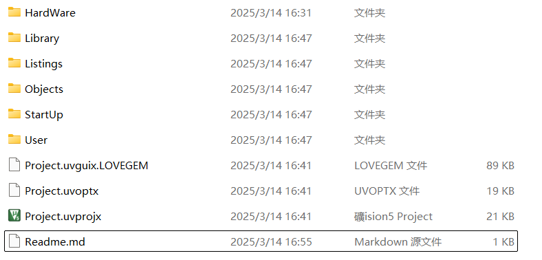
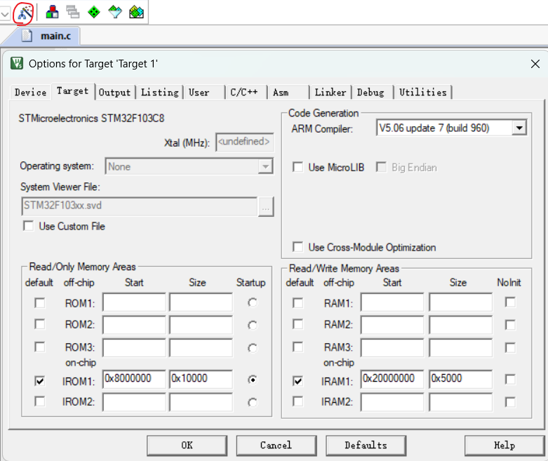
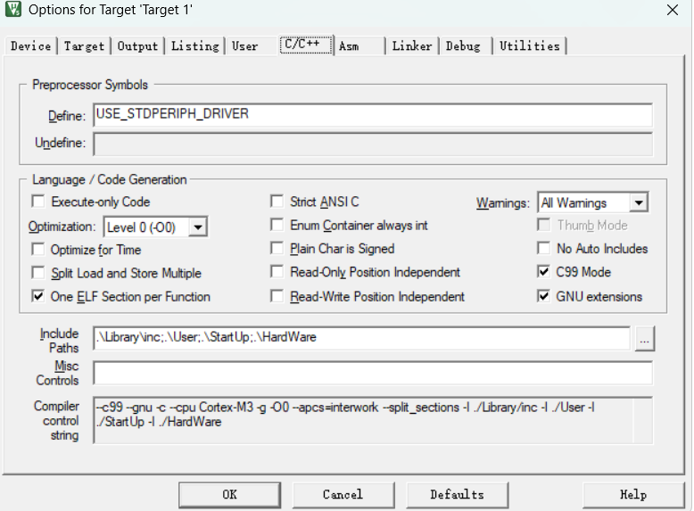

## STM32标准库Keil工程配置

​	确认所选芯片的版本号（本次使用`STM32F103C8T6`配置）。Keil开发环境已正确安装，相关芯片的芯片包已正确安装，所用烧录工具为`STLINK V2`，确保烧录工具驱动已正确安装且能正确识别。

​	首先来看`STM32`的标准库工程结构：

​	

​	`STM32`标准库工程结构通常以**启动文件、库文件、用户代码、头文件包含路径和编译配置文件**为核心，以上图为例：

- `User`文件夹顾名思义，存放用户的**代码逻辑**（写在`main.c`中的业务逻辑）以及**标准库配置文件和配套的中断处理文件**。
- `StartUp`文件夹存放32的**启动文件，内核文件与系统初始化文件以及芯片寄存器地址映射文件**。
- `Library`文件夹则存放了**标准库的外设库文件**。
- `HardWare`文件夹我则用于存放一些用户所写的驱动逻辑等等。避免全部夹杂在`User`中造成混乱。
- `Object`与`Listings` 则用于存放编译器生成的目标文件（.obj文件）以及列表文件（.lst）。

当然，工程的排版可以根据自身喜好和需求来，但整体的框架是不变的。

### 步骤：

​	<一> ： 首先在 `keil`主页面点击 -> `Project`选项卡 -> `New μVision Project` -> 选择工程存放路径 ->  命名后选择对应的芯片版本确认即可。

​	工程正确创建后，在所选文件夹目录下将会出现对应的文件夹与工程文件。

​	<二>：在新工程目录下创建 `User` , `StartUp` , `Library` , `HardWare`等文件夹 。进入标准固件库文件夹中（没有可到官网下载），找到`core_cm3.c` 和 `core_cm3.h`，并将其放入我们的`StartUp`文件夹中。同理找到 我们的启动文件`startup_stm32f10x_md.s`，系统初始化文件`system_stm32f10x.c`，`system_stm32f10x.h`，寄存器地址映射文件`stm32f10x.h` ，统统将其放入`StartUp`文件夹。

​	<三>：同理在标准固件库文件夹中找到 所有的外设库文件（形如`stm32f10x_xxx.h`，`stm32f10x_xxx.c`，xxx为相对应的固件名称），并将所有的.c与.h文件放入`Library`文件夹中。（最好在`Library`中继续新建文件夹将头文件与源文件区分开）。

​	<四>：找到`stm32f10x_conf.h` ， `stm32f10x_it.c`， `stm32f10x_it.h`这三个文件，并将其一并放入`User`。至此，启动文件，库文件，库配置文件以及中断处理等逻辑已经全部整合到我们的工程中了，接下来所要做的就是在`Keil`中将其全部联系起来。

​	<五>：进入 Keil，点击`Options for Target`（也就是常说的魔法棒），出现如下图菜单

​	首先在`Target`菜单卡`ARM Compiler`处选择对应的编译器（新版本编译器对于某些设备可能出现无法编译的情况，此处选用稳定的V5版本）。而后进入 C/C++菜单卡在宏定义 `Define`处填入：`USE_STDPERIPH_DRIVER` （这个宏定义用于启动标准库。具体可在`stm32f10x.h`文件末尾找到），勾上C99Mode，在`Include Path`栏目中将工程目录所有存在头文件的路径加入到其中。具体设置如下

​	而后进入到`Debug`菜单卡，选择你所使用的烧录工具（此处使用ST-LINK）点击 `Setting` -> `Flash Download`，将`Rest and Run`勾上，这可以使烧录后立马复位重跑。Erase相关的为Flash的擦除方式，Erase Full Chip将会擦除掉整个Flash的内容，将整个设备初始化为初始状态,擦除整个芯片会增加闪存的磨损，最好避免频繁擦除。Erase Sector为部分擦除，只擦除特定的扇区，此处我们使用该默认方式即可。

​	至此工程已设置完毕，创建main文件并向其中写入测试用例测试即可。

